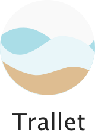

# Trallet  
Your Travel-Budget-App

Hey, nice to meet you! I'm Trallet, your wallet on travels. Use me on your next journey to always have an overview over your budget, see the sum of your spendings and the average per day. You can add spendings and filter for them by category and/or date. 

This is my first project and masterpiece of the twelve weeks coding bootcamp at "neue fische" in Cologne, Germany to become a web developer.


# Getting Started

By following the next steps you will get a copy of the project to run it on your local machine.


# Installing

After cloning this to your machine, you need to install node_modules on server and client side.

First on the server side
````
npm install
````
and then on the client side
````
client
npm install
````
In the next step please create a `db.json` file to your server side.


# Running the application

Open two terminals next to each other.

In the first one you enter
`````
npm run client
`````
in the second one you enter
`````
npm run server
`````
Please open the link in browser and start using Trallet by entering a new journey. Enjoy using Trallet and of course your next journey! 
